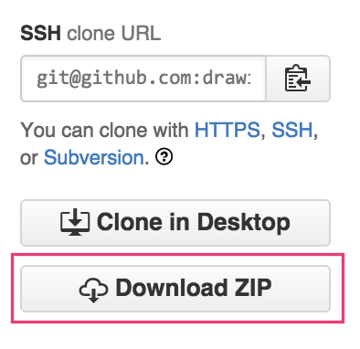
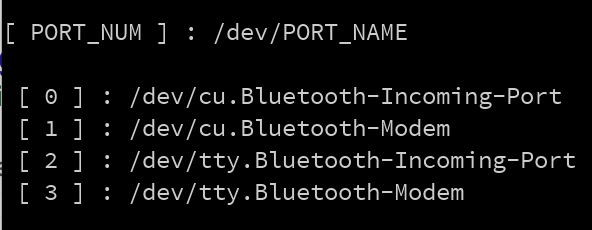

#Drawing Machines

###Course Repository, ID-20ST-15

Welcome to Drawing Machines! This repository contains all software and firmware examples used throughout the 2015 RISD ID Drawing Machines Course (ID-20ST-15).

Thise repository will primarily make use of two branches: `master` and `dev`. The `master` branch will be the most stable and tested code, while the development (or dev) branch will less stable and tested code, used for development. At times you may see feature branches (i.e. `some-new-feature`). These are used to develop (big surprise) new features (or separate streams of work) that will eventually get pulled back into the `dev` branch, and later into the stable (and tested) `master` branch. You shouldn't need to use code in any of the feature or development branches unless you are contributing to the code examples in some way. If you would like to contribute code please contact `mmansion@risd.edu` or `kuanju@tellart.com`. Note that you are free to fork any of the branches and develop separate streams of work at any time.

###Getting Started

#### Install library dependencies

The Arduino firmware for the Draw Bot requires two additional libraries be installed on your computer. Installing libraries is simple. Here are the steps:

1. Download the [Adafruit Motor Shield v2 library](https://github.com/ladyada/Adafruit_Motor_Shield_V2_Library/archive/master.zip)

2. Download the [AccelStepper Library](https://github.com/adafruit/AccelStepper/archive/master.zip) (with Adafruit Motorshield support)

3. Libraries should be placed in the `libraries` folder of your Arduino sketch directy. You can set where your sketch directory is by using the Arduino IDE system preferences. 

	[Follow the instructions](https://learn.adafruit.com/adafruit-all-about-arduino-libraries-install-use) for installing libraries for Arduino. 

	More information can about the [Arduino IDE v1.6x can be found here](https://learn.adafruit.com/adafruit-arduino-ide-setup/arduino-1-dot-6-x-ide).

#### Uploading the firmware

1. Clone the **master** branch of this repo using Git, or download it using the "Download Zip" button.

	
	

2. Open the `BOT_FIRMWARE` folder, and then open the `BOT_FIRMWARE.ino` file using the [Arduino IDE](https://www.arduino.cc/en/Main/Software)

	
	
3. Verify that the code compiles by clicking the `verify` button. It has a checkmark icon. Note that if you installed the Arduino libraries while the IDE was open, you will need to restart the Arduino app. 

	

4. Connect your USB cable to the Arduino microcontroller.

	

5. Select `Arduino UNO` from the `Board` Menu, under `Tools` in the Arduino IDE

	
	
6. Select the active USB/Serial port from the `Port` menu, under `Tools` in the Arduino IDE

	
	
7. Click the `upload` button to flash the firmware onto the Arduino device. During this process a small light will blink on the Arduino (it might be covered by the motor shield) and an upload progress bar will show up at the bottom of the Arduino IDE. When the process is complete, the  IDE will indicate `Done Uploading`.

	
	
	
	
	
	
8. Plug in the motor power cable to the Drawing Bot

	

9. Open the `BOT_APP_MANUAL.pde` sketch in Processing and click the `run` button.

	
	
	
	
10. At the bottom of the Processing window, in the console, look for the `port` number that the Arduino is connected to. Enter this `PORT_NUM` at the top of the sketch, and run the app again.11. 

	
	
	
	
	
11. If the `BOT_APP_MANUAL` connected succesfully to the Drawing Bot, you should be able to click on any of th controls to move the robot's arm forward, backward, left, and right. Clicking the center button raises and lowers the pen. You may also use the arrow keys up, down, left, right for direction; and the spacebar for controlling the pen servo.

	

